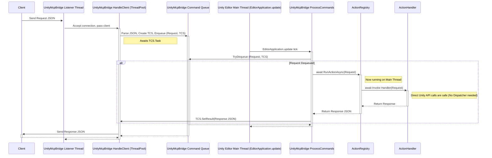

# Unity MCP Bridge Architecture

This document outlines the architecture of the Unity MCP (Model Context Protocol) Bridge, focusing on how external commands are received, processed, and executed within the Unity Editor environment.

## Core Components

1. **TCP Listener (`UnityMcpBridge`):** Runs on a dedicated background thread, listening for incoming TCP connections on a configured port (default: 6400).
2. **Client Handler (`UnityMcpBridge`):** Each accepted TCP connection is managed by a handler running on a `ThreadPool` thread. Its primary role is to read incoming data, enqueue it for processing, wait for the result, and send the response back to the client.
3. **Command Queue (`UnityMcpBridge`):** A thread-safe queue (e.g., `ConcurrentQueue`) holding pending commands received from clients. Each item contains the parsed request JSON and callbacks/synchronization primitives necessary to return the result to the correct client handler.
4. **Command Processor (`UnityMcpBridge`):** A method registered with `UnityEditor.EditorApplication.update`. This ensures it runs repeatedly on the **Unity main thread** during editor updates. It dequeues commands and orchestrates their execution.
5. **Action Registry (`ActionRegistry`):** A central registry mapping action name strings (e.g., `"create_asset"`) to their corresponding request data type and synchronous handler function.
6. **Action Handlers (Various Classes):** Static methods responsible for implementing the logic for a specific action (e.g., `AssetCreateModifyActions.HandleCreateAsset`). They receive a specific request object and return a response object. See the [Actions.md](Actions.md) document for a list of available actions and their handlers as well as details on how to add new actions.

## Request Lifecycle & Threading Model

The key principle of this architecture is to ensure that all Unity API calls, which must occur on the main thread, are executed safely without requiring manual thread marshalling within individual action handlers.

**Flow:**

1. A client connects and sends a JSON request.
2. The `ListenerThread` accepts the connection and passes it to a `ClientHandler` on the `ThreadPool`.
3. The `ClientHandler` reads and parses the JSON request.
4. It creates necessary callbacks or synchronization primitives (like `ManualResetEventSlim`) to wait for the result.
5. It enqueues the parsed request and the callbacks/primitives into the `CommandQueue`.
6. The `ClientHandler` then blocks/waits for the result via the callback or primitive.
7. On a subsequent `EditorApplication.update` tick, the `CommandProcessor` (running on the **main thread**) dequeues the request.
8. The `CommandProcessor` calls the synchronous `ActionRegistry.RunAction` method, passing the request.
9. The `ActionRegistry` identifies the correct synchronous `ActionHandler` based on the action name.
10. The `ActionHandler` executes **synchronously on the main thread**. Because it's on the main thread, it can safely interact with any Unity Editor APIs directly.
11. The handler returns a response object.
12. The result propagates back to the `CommandProcessor`.
13. The `CommandProcessor` invokes the appropriate callback provided by the `ClientHandler`, passing the serialized response JSON or any exception that occurred.
14. The callback signals the waiting `ClientHandler`, providing the result.
15. The `ClientHandler` wakes up, sends the response JSON back to the client over the TCP connection, and typically closes the connection.

This model centralizes main-thread execution at the `CommandProcessor` level, simplifying action handler implementation significantly.
