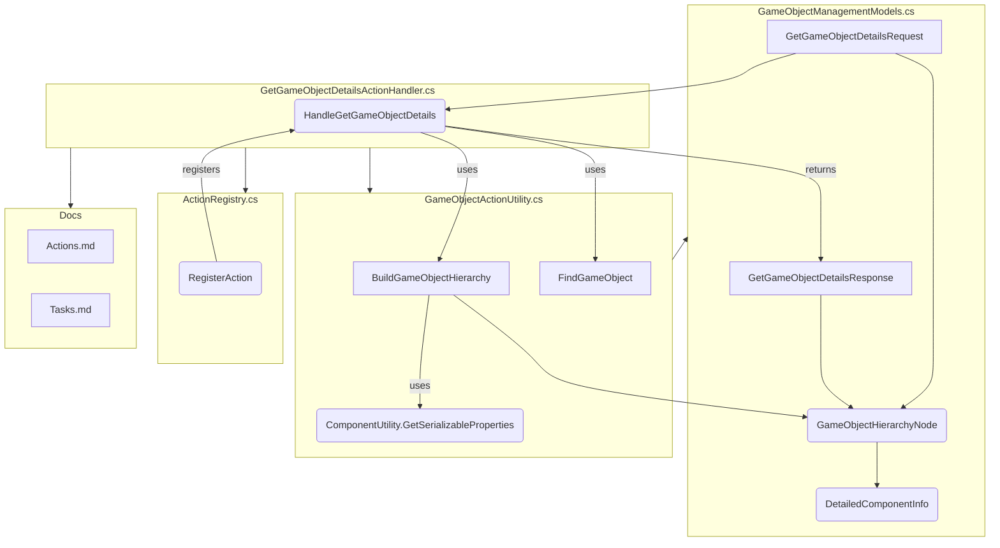

# Task: Add Get GameObject Info

Similar to the PrefabManagement's GetPrefabDetailsActionHandler, we need one that gets the GameObject details in the exact same way.  The expected input is a GameObject in the current scene. It should return effectively the exact same output as the PrefabManagement's GetPrefabDetailsActionHandler.

## Task: Implement `get_gameobject_details` Action

**Goal:** Create a new MCP action `get_gameobject_details` that returns a hierarchical representation of a specified GameObject in the current scene, similar to how `get_prefab_details` works for prefabs.

**Context:** This action allows external tools to inspect the structure and properties of GameObjects within the active Unity scene.

**Implementation Steps:**

1. **Define Models (`Packages/com.logar16.unity-mcp/Editor/Models/GameObjectManagementModels.cs`):**
    * Add a new request class `GetGameObjectDetailsRequest`:
        * Inherit from `BaseMcpRequest`.
        * `[JsonProperty("target")] public string target { get; set; }`: Identifier (Instance ID, Name, or Path) for the root GameObject. Add XML comments explaining the identifier types.
        * `[JsonProperty("include_children")] public bool include_children { get; set; } = true;`: Flag to include child hierarchy. Add XML comments.
        * `[JsonProperty("include_component_details")] public bool include_component_details { get; set; } = false;`: Flag to include detailed component properties. Add XML comments.
    * Add a new node class `GameObjectHierarchyNode`:
        * `[JsonProperty("name")] public string name { get; set; }`
        * `[JsonProperty("path")] public string path { get; set; }`: Full hierarchy path from the scene root.
        * `[JsonProperty("tag")] public string tag { get; set; }`
        * `[JsonProperty("layer")] public int layer { get; set; }`
        * `[JsonProperty("instance_id")] public int instance_id { get; set; }`: Unity Instance ID.
        * `[JsonProperty("component_types")] public List<string> component_types { get; set; }`
        * `[JsonProperty("components", NullValueHandling = NullValueHandling.Ignore)] public List<DetailedComponentInfo> components { get; set; }`: Use `NullValueHandling.Ignore` so it's omitted if empty/null.
        * `[JsonProperty("children", NullValueHandling = NullValueHandling.Ignore)] public List<GameObjectHierarchyNode> children { get; set; }`: Use `NullValueHandling.Ignore`.
    * Ensure `DetailedComponentInfo` exists (likely shared or needs copying/moving from `PrefabManagementModels.cs` if not already in `CommonModels.cs` or similar). It should contain:
        * `[JsonProperty("type_name")] public string type_name { get; set; }`
        * `[JsonProperty("properties")] public Dictionary<string, object> properties { get; set; }`
    * Add a new response class `GetGameObjectDetailsResponse`:
        * Inherit from `BaseMcpResponse`.
        * `[JsonProperty("hierarchy")] public GameObjectHierarchyNode hierarchy { get; set; }`

2. **Create Utility Function (`Packages/com.logar16.unity-mcp/Editor/Utility/GameObjectActionUtility.cs`):**
    * Add a new public static method `BuildGameObjectHierarchy`:
        * Signature: `public static GameObjectHierarchyNode BuildGameObjectHierarchy(GameObject go, string pathPrefix = "", bool includeChildren = true, bool includeComponentDetails = false)`
        * Logic:
            * Handle `go == null` case (return null).
            * Construct the `path` string (use `GetHierarchyPath` or build incrementally).
            * Create a new `GameObjectHierarchyNode`.
            * Populate basic properties: `name`, `path`, `tag`, `layer`, `instance_id`.
            * Get component types: `go.GetComponents<Component>().Select(c => c?.GetType().FullName ?? "null").ToList()`. Handle potential null components.
            * If `includeComponentDetails`:
                * Initialize `node.components`.
                * Iterate through `go.GetComponents<Component>()`.
                * For each non-null component, create `DetailedComponentInfo` using `ComponentUtility.GetSerializableProperties(comp)` and add it to `node.components`.
            * If `includeChildren` and `go.transform.childCount > 0`:
                * Initialize `node.children`.
                * Iterate through children using `go.transform.GetChild(i)`.
                * Recursively call `BuildGameObjectHierarchy` for each child, passing the updated `pathPrefix` and flags. Add the result to `node.children`.
            * Return the populated `node`.

3. **Implement Action Handler (`Packages/com.logar16.unity-mcp/Editor/Actions/GameObjectManagement/GetGameObjectDetailsActionHandler.cs`):**
    * Create a new file for the class `GetGameObjectDetailsActionHandler`.
    * Add `using` statements for necessary namespaces (UnityEngine, UnityEditor, Models, Core, Utility).
    * Define the `public static class GetGameObjectDetailsActionHandler`.
    * Add the `[InitializeOnLoad]` attribute.
    * Create a static constructor:
        * Call `ActionRegistry.RegisterAction<GetGameObjectDetailsRequest>("get_gameobject_details", HandleGetGameObjectDetails);`
    * Implement the handler method:
        * Signature: `public static GetGameObjectDetailsResponse HandleGetGameObjectDetails(GetGameObjectDetailsRequest request)`
        * Use `GameObject targetObject = GameObjectActionUtility.FindGameObject(request.target);` to find the target.
        * If `targetObject == null`, return `new GetGameObjectDetailsResponse().Fail(request, $"Could not find GameObject target: {request.target}") as GetGameObjectDetailsResponse;`.
        * Call `GameObjectHierarchyNode hierarchy = GameObjectActionUtility.BuildGameObjectHierarchy(targetObject, "", request.include_children, request.include_component_details);` (Note: Pass empty string for initial pathPrefix).
        * Create the response: `var response = new GetGameObjectDetailsResponse { hierarchy = hierarchy };`
        * Return `response.Success(request) as GetGameObjectDetailsResponse;`.
        * Consider adding a try-catch block around the core logic for robustness, similar to `GetPrefabDetailsActionHandler`.

4. **Update Documentation:**
    * **`Packages/com.logar16.unity-mcp/docs/Actions.md`**: Add a new section for `get_gameobject_details` under game object group describing its purpose, implementation details of note and response structure (hierarchy based on `GameObjectHierarchyNode`) but without mentioning every single field.

**Diagram:**

---
